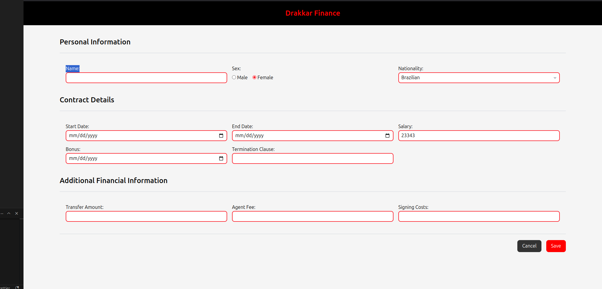
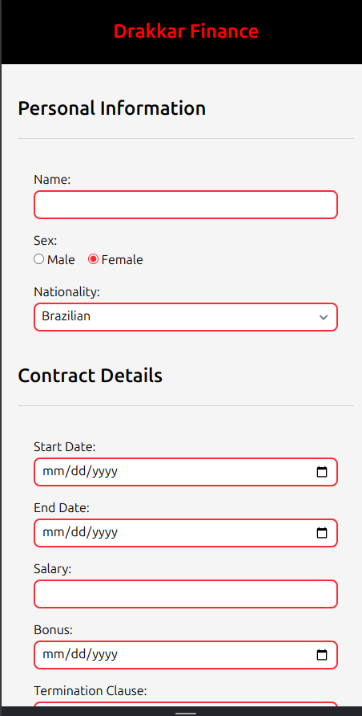

# Drakkar Finance ( HTML )

This is a simple project built using HTML and TailwindCSS, featuring a comprehensive form for managing player contracts for the fictional football team "Dragões do Ébano FC." The form includes multiple sections to capture essential information such as personal information, contract details and additional financial information.

**This project was developed in just a few hours as part of a training exercise over the weekend.**

## Technologies Used

- **HTML**: The basic structure of the page.
- **TailwindCSS**: A utility-first CSS framework used to style the page quickly and responsively.

## Screenshots

## License

This project is open source under the MIT license. Feel free to use and modify the code for your own projects.
